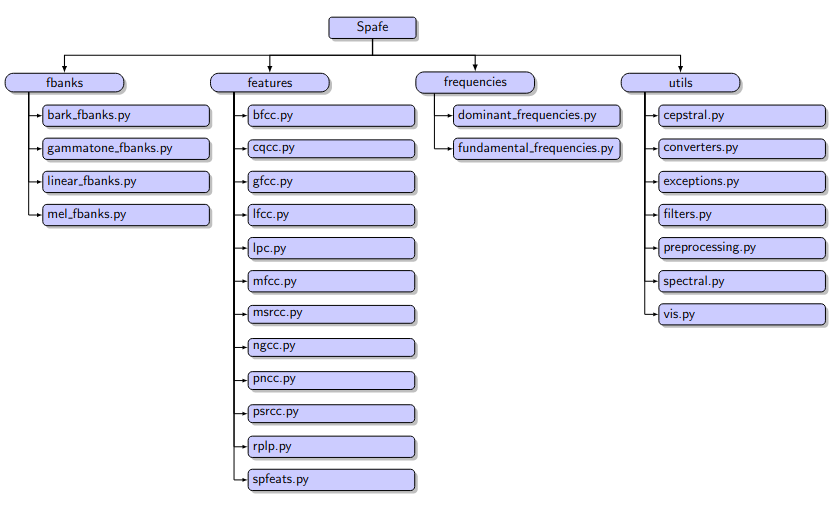

Spafe: Simplified Python Audio Features Extraction
==================================================

[](https://travis-ci.org/SuperKogito/spafe) [](https://spafe.readthedocs.io/en/latest/?badge=latest) [%20-blue)](https://github.com/SuperKogito/spafe/blob/master/LICENSE) [](https://www.python.org/doc/versions/) [](https://coveralls.io/github/SuperKogito/spafe?branch=master) [](https://codecov.io/gh/SuperKogito/spafe) [](https://badge.fury.io/py/spafe) [](https://anaconda.org/SuperKogito/spafe) [](https://pepy.tech/project/spafe) [](https://www.codacy.com/manual/SuperKogito/spafe?utm_source=github.com&utm_medium=referral&utm_content=SuperKogito/spafe&utm_campaign=Badge_Grade) [](https://codebeat.co/projects/github-com-superkogito-spafe-master)


#  Table of Contents

- [Spafe](#Spafe)
- [Installation](#Installation)
  - [Dependencies](#Dependencies)
  - [Installation guide](#Installation-guide)
- [How to use](#How-to-use)
- [Contributing](#Contributing)
- [Citing](#citing)

# Spafe
spafe aims to simplify features extractions from **mono audio** files.
Spafe includes various computations related to filter banks, spectrograms, frequencies and cepstral features .
The library has the following structure:


## Filter banks

  - ***Bark filter banks***
  - ***Gammatone filter banks***
  - ***Linear filter banks***
  - ***Mel filter banks***

## Spectrograms
  
  - ***Bark spectrogram***
  - ***CQT spectrogram***
  - ***Erb spectrogram***
  - ***Mel spectrogram***

## Features

  - ***Bark Frequency Cepstral Coefficients (BFCCs)***
  - ***Constant Q-transform Cepstral Coefficients (CQCCs)***
  - ***Gammatone Frequency Cepstral Coefficients (GFCCs)***
  - ***Linear Frequency Cepstral Coefficients (LFCCs)***
  - ***Linear Prediction Components (LPCs)***
  - ***Mel Frequency Cepstral Coefficients (MFCCs)***
  - ***Inverse Mel Frequency Cepstral Coefficients (IMFCCs)***
  - ***Magnitude based Spectral Root Cepstral Coefficients (MSRCCs)***
  - ***Normalized Gammachirp Cepstral Coefficients (NGCCs)***
  - ***Power-Normalized Cepstral Coefficients (PNCCs)***
  - ***Phase based Spectral Root Cepstral Coefficients (PSRCCs)***
  - ***Perceptual Linear Prediction Coefficents (PLPs)***
  - ***Rasta Perceptual Linear Prediction Coefficents (RPLPs)***

The theory behind features computed using spafe can be summmarized in the following graph:


## Frequencies

  - ***Dominant frequencies***
  - ***Fundamental frequencies***

## Installation
### Dependencies

spafe requires:

-	[Python](https://www.python.org/) (>= 3.5)
-	[NumPy](https://numpy.org/) (>= 1.18.1)
-	[SciPy](https://scipy.org/) (>= 1.4.1)

if you want to use the visualization module/ functions of spafe, you will need to install:

- [Matplotlib](https://matplotlib.org/) (>= 3.5.2)


### Installation guide
Once you have the Dependencies installed, use one of the following install options.

#### Install from PyPI
- To freshly install spafe:
```
pip install -U spafe
```
-  To update an existing installation:
```
pip install -U spafe
```

#### Install from Anaconda
- Spafe is also available on anaconda:
```
conda install spafe
```

### Install from source
- You can build spafe from source, by following:
```
git clone git@github.com:SuperKogito/spafe.git
cd spafe
python setup.py install
```

## How to use

Various examples on how to use spafe are present in the documentation [https://superkogito.github.io/spafe/dev/](https://superkogito.github.io/spafe/dev/).

**<!>** Please make sure you are referring to the correct documentation version.

## Contributing

Contributions are welcome and encouraged. To learn more about how to contribute to spafe please refer to the [Contributing guidelines](https://github.com/SuperKogito/spafe/blob/master/CONTRIBUTING.md)

## Citing

If you want to cite spafe in your work, use the following:
```
@software{ayoub_malek_2020,
    author  = {Ayoub Malek},
    title   = {spafe/spafe: 0.1.2},
    month   = Apr,
    year    = 2020,
    version = {0.1.2},
    url     = {https://github.com/SuperKogito/spafe}
}
```
