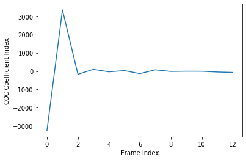

spafe.features.cqcc
====================

.. automodule:: spafe.features.cqcc
    :members:
    :undoc-members:
    :show-inheritance:

Example:

.. code-block:: python

  import scipy.io.wavfile
  import spafe.utils.vis as vis
  from spafe.features.mfcc import cqcc

  #read wave file
  fs, sig = scipy.io.wavfile.read('../test.wav')

  # compute cqccs
  cqccs  = cqcc(sig, 13)

  # visualize features
  vis.plot(cqccs, 'CQCC Index','Frame Index')

