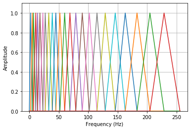
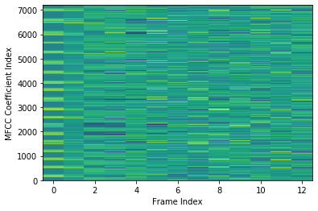

spafe.fbanks
------------

### Bark filterbanks

```
import matplotlib.pyplot as plt
from spafe.fbanks import bark_fbanks

# compute fbanks
fbanks = bark_fbanks.bark_filter_banks(nfilts=24, nfft=512, fs=16000)

# plot fbanks
for i in range(len(fbanks)):
    plt.plot(fbanks[i])
    plt.ylim(0, 1.1)
    plt.grid(True)
    plt.ylabel(ylabel)
    plt.xlabel(xlabel)
    plt.show()
```

<p align="center">

</p>

### Gammatone filterbanks

```
import matplotlib.pyplot as plt
from spafe.fbanks import gammatone_fbanks

# compute fbanks
fbanks = gammatone_fbanks.gammatone_filter_banks(nfilts=24, nfft=512, fs=16000)

# plot fbanks
for i in range(len(fbanks)):
   plt.plot(fbanks[i])
   plt.ylim(0, 1.1)
   plt.grid(True)
   plt.ylabel(ylabel)
   plt.xlabel(xlabel)
   plt.show()
```

<p align="center">

</p>

### Mel filterbanks

```
import matplotlib.pyplot as plt
from spafe.fbanks import mel_fbanks

# compute fbanks
fbanks = mel_fbanks.mel_filter_banks(nfilts=24, nfft=512, fs=16000)

# plot fbanks
for i in range(len(fbanks)):
    plt.plot(fbanks[i])
    plt.ylim(0, 1.1)
    plt.grid(True)
    plt.ylabel(ylabel)
    plt.xlabel(xlabel)
    plt.show()
```

<p align="center">

</p>

spafe.features
--------------

### MFCC, IMFCC, MFE

```
import scipy.io.wavfile
import spafe.utils.vis as vis
from spafe.features.mfcc import mfcc, imfcc, mfe


# read wave file
fs, sig = scipy.io.wavfile.read('../test.wav')

# compute mfccs and mfes
mfccs  = mfcc(sig, 13)
imfccs = imfcc(sig, 13)
mfes   = mfe(sig, fs)

# visualize features
vis.visualize(mfccs, 'MFCC Coefficient Index','Frame Index')
vis.visualize(imfccs, 'IMFCC Coefficient Index','Frame Index')
vis.plot(mfes,  'MFE Coefficient Index','Frame Index')
```

<p align="center">

</p>

<p align="center">

</p>

<p align="center">

</p>
